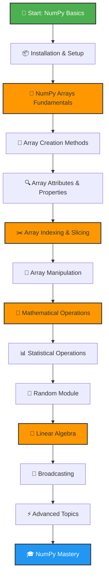

# 🧮 NumPy Learning Repository

<div align="center">


**A structured, hands-on approach to mastering NumPy**

[Official Docs](https://numpy.org/doc/) • [Quick Start](https://numpy.org/doc/stable/user/quickstart.html) • [API Reference](https://numpy.org/doc/stable/reference/)

</div>

---

## 📚 About This Repository

This repository contains my personal learning journey through NumPy, with each topic organized in separate files for better understanding and future reference. Each file contains practical code examples and implementations.

---

## 🗺️ Learning Path



---

## 📖 Curriculum

### 🌱 Phase 1: Foundation

#### 1️⃣ Installation & Environment Setup
- [ ] **Install NumPy**
  - Installing via pip: `pip install numpy`
  - Verifying installation
  - Importing NumPy: `import numpy as np`
- [ ] **Understanding Python Lists vs NumPy Arrays**
  - Performance comparison
  - Memory efficiency
  - When to use NumPy

**📚 Resources:**
- [NumPy Installation Guide](https://numpy.org/install/)
- [Python NumPy Tutorial - W3Schools](https://www.w3schools.com/python/numpy/)

**📁 File:** `01_installation_setup.py`

---

#### 2️⃣ NumPy Arrays Fundamentals
- [ ] **What is ndarray?**
  - Understanding multidimensional arrays
  - Array vs List performance
- [ ] **Creating Basic Arrays**
  - From Python lists
  - Using `np.array()`
  - Array data types (dtype)
- [ ] **Array Dimensions**
  - 1D arrays (vectors)
  - 2D arrays (matrices)
  - 3D and higher dimensional arrays

**📚 Resources:**
- [NumPy Quickstart Tutorial](https://numpy.org/doc/stable/user/quickstart.html)
- [Array Creation - Official Docs](https://numpy.org/doc/stable/user/basics.creation.html)

**📁 File:** `02_array_fundamentals.py`

---

#### 3️⃣ Array Creation Methods
- [ ] **Zero and Ones Arrays**
  - `np.zeros()` - Array filled with zeros
  - `np.ones()` - Array filled with ones
  - `np.full()` - Array filled with a constant
- [ ] **Range-based Arrays**
  - `np.arange()` - Similar to Python range()
  - `np.linspace()` - Evenly spaced values
  - `np.logspace()` - Logarithmically spaced values
- [ ] **Special Arrays**
  - `np.eye()` / `np.identity()` - Identity matrix
  - `np.empty()` - Uninitialized array
  - `np.diag()` - Diagonal matrix
- [ ] **Random Arrays** (Basic)
  - `np.random.rand()` - Uniform distribution
  - `np.random.randn()` - Normal distribution
  - `np.random.randint()` - Random integers

**📚 Resources:**
- [Array Creation Routines](https://numpy.org/doc/stable/reference/routines.array-creation.html)
- [Real Python - NumPy Arrays](https://realpython.com/numpy-array-programming/)

**📁 File:** `03_array_creation.py`

---

#### 4️⃣ Array Attributes & Properties
- [ ] **Shape and Dimensions**
  - `.shape` - Array dimensions
  - `.ndim` - Number of dimensions
  - `.size` - Total number of elements
- [ ] **Data Type Information**
  - `.dtype` - Data type of elements
  - `.itemsize` - Size of each element in bytes
  - `.nbytes` - Total bytes consumed
- [ ] **Array Flags**
  - `.flags` - Memory layout information

**📚 Resources:**
- [Array Attributes](https://numpy.org/doc/stable/reference/arrays.ndarray.html#array-attributes)
- [NumPy Data Types](https://numpy.org/doc/stable/user/basics.types.html)

**📁 File:** `04_array_attributes.py`

---

### 🚀 Phase 2: Core Operations

#### 5️⃣ Array Indexing & Slicing
- [ ] **Basic Indexing**
  - Single element access
  - Negative indexing
  - Multi-dimensional indexing
- [ ] **Slicing Operations**
  - 1D array slicing
  - 2D array slicing (rows and columns)
  - Step values in slicing
  - Slicing with ellipsis (...)
- [ ] **Boolean Indexing**
  - Conditional array selection
  - Masking arrays
- [ ] **Fancy Indexing**
  - Integer array indexing
  - Multiple index arrays

**📚 Resources:**
- [Indexing and Slicing](https://numpy.org/doc/stable/user/basics.indexing.html)
- [Advanced Indexing](https://numpy.org/doc/stable/reference/arrays.indexing.html)

**📁 File:** `05_indexing_slicing.py`

---

#### 6️⃣ Array Manipulation
- [ ] **Reshaping Arrays**
  - `.reshape()` - Change array shape
  - `.flatten()` - Convert to 1D
  - `.ravel()` - Flattened view
  - `.transpose()` / `.T` - Swap axes
- [ ] **Joining Arrays**
  - `np.concatenate()` - Join along existing axis
  - `np.vstack()` - Vertical stack
  - `np.hstack()` - Horizontal stack
  - `np.stack()` - Join along new axis
- [ ] **Splitting Arrays**
  - `np.split()` - Split into multiple arrays
  - `np.hsplit()` - Horizontal split
  - `np.vsplit()` - Vertical split
- [ ] **Adding/Removing Elements**
  - `np.append()` - Append values
  - `np.insert()` - Insert values
  - `np.delete()` - Delete values
  - `np.resize()` - Change size

**📚 Resources:**
- [Array Manipulation Routines](https://numpy.org/doc/stable/reference/routines.array-manipulation.html)
- [Reshaping Arrays Tutorial](https://numpy.org/doc/stable/user/basics.reshape.html)

**📁 File:** `06_array_manipulation.py`

---

#### 7️⃣ Mathematical Operations
- [ ] **Basic Arithmetic**
  - Addition, subtraction, multiplication, division
  - Element-wise operations
  - Scalar operations
- [ ] **Universal Functions (ufuncs)**
  - `np.add()`, `np.subtract()`, `np.multiply()`, `np.divide()`
  - `np.power()`, `np.sqrt()`, `np.exp()`, `np.log()`
  - Trigonometric functions: `np.sin()`, `np.cos()`, `np.tan()`
- [ ] **Rounding Operations**
  - `np.round()`, `np.floor()`, `np.ceil()`
  - `np.trunc()`, `np.rint()`
- [ ] **Aggregate Functions**
  - `np.sum()`, `np.prod()`
  - `np.cumsum()`, `np.cumprod()`
  - `np.diff()` - Differences between elements

**📚 Resources:**
- [Mathematical Functions](https://numpy.org/doc/stable/reference/routines.math.html)
- [Universal Functions (ufunc)](https://numpy.org/doc/stable/reference/ufuncs.html)

**📁 File:** `07_mathematical_operations.py`

---

#### 8️⃣ Statistical Operations
- [ ] **Basic Statistics**
  - `np.mean()` - Average value
  - `np.median()` - Median value
  - `np.std()` - Standard deviation
  - `np.var()` - Variance
- [ ] **Min/Max Operations**
  - `np.min()`, `np.max()`
  - `np.argmin()`, `np.argmax()` - Indices
  - `np.ptp()` - Peak to peak (range)
- [ ] **Percentiles & Quantiles**
  - `np.percentile()`
  - `np.quantile()`
- [ ] **Correlation & Covariance**
  - `np.corrcoef()` - Correlation coefficient
  - `np.cov()` - Covariance matrix
- [ ] **Histogram**
  - `np.histogram()` - Compute histogram
  - `np.bincount()` - Count occurrences

**📚 Resources:**
- [Statistics Functions](https://numpy.org/doc/stable/reference/routines.statistics.html)
- [Statistical Analysis with NumPy](https://realpython.com/numpy-scipy-pandas-correlation-python/)

**📁 File:** `08_statistical_operations.py`

---

### 🎯 Phase 3: Advanced Concepts

#### 9️⃣ Random Module
- [ ] **Random Number Generation**
  - `np.random.rand()` - Uniform [0, 1)
  - `np.random.randn()` - Standard normal
  - `np.random.randint()` - Random integers
  - `np.random.random()` - Random floats
- [ ] **Probability Distributions**
  - `np.random.normal()` - Normal distribution
  - `np.random.uniform()` - Uniform distribution
  - `np.random.binomial()` - Binomial distribution
  - `np.random.poisson()` - Poisson distribution
- [ ] **Random Sampling**
  - `np.random.choice()` - Random sampling
  - `np.random.shuffle()` - Shuffle array
  - `np.random.permutation()` - Random permutation
- [ ] **Random Generator (New API)**
  - `np.random.default_rng()` - Modern random generator
  - Seeding and reproducibility

**📚 Resources:**
- [Random Sampling](https://numpy.org/doc/stable/reference/random/index.html)
- [NumPy Random Generator](https://numpy.org/doc/stable/reference/random/generator.html)

**📁 File:** `09_random_module.py`

---

#### 🔟 Linear Algebra Operations
- [ ] **Matrix Operations**
  - `np.dot()` - Dot product
  - `np.matmul()` / `@` - Matrix multiplication
  - `np.inner()`, `np.outer()` - Inner/outer products
- [ ] **Matrix Properties**
  - `np.linalg.det()` - Determinant
  - `np.linalg.inv()` - Inverse
  - `np.trace()` - Trace
  - `np.linalg.matrix_rank()` - Rank
- [ ] **Decomposition**
  - `np.linalg.eig()` - Eigenvalues and eigenvectors
  - `np.linalg.svd()` - Singular Value Decomposition
  - `np.linalg.qr()` - QR decomposition
- [ ] **Solving Systems**
  - `np.linalg.solve()` - Solve linear equations
  - `np.linalg.lstsq()` - Least squares solution
- [ ] **Norms**
  - `np.linalg.norm()` - Vector/matrix norms

**📚 Resources:**
- [Linear Algebra (numpy.linalg)](https://numpy.org/doc/stable/reference/routines.linalg.html)
- [Linear Algebra on NumPy](https://numpy.org/doc/stable/user/tutorial-svd.html)

**📁 File:** `10_linear_algebra.py`

---

#### 1️⃣1️⃣ Broadcasting
- [ ] **Understanding Broadcasting**
  - Broadcasting rules
  - Shape compatibility
  - Memory efficiency
- [ ] **Broadcasting in Action**
  - Scalar and array operations
  - Array with different shapes
  - Practical examples
- [ ] **Broadcasting Functions**
  - `np.broadcast_to()`
  - `np.broadcast_arrays()`
  - `np.expand_dims()`

**📚 Resources:**
- [Broadcasting](https://numpy.org/doc/stable/user/basics.broadcasting.html)
- [Broadcasting Tutorial](https://numpy.org/doc/stable/user/theory.broadcasting.html)

**📁 File:** `11_broadcasting.py`

---

### 💎 Phase 4: Advanced & Optimization

#### 1️⃣2️⃣ Advanced Indexing & Views
- [ ] **Views vs Copies**
  - Understanding memory views
  - `.view()` vs `.copy()`
  - When copies are created
- [ ] **Advanced Boolean Indexing**
  - Multiple conditions
  - `np.where()` - Conditional selection
  - `np.select()` - Multiple conditions
- [ ] **Structured Arrays**
  - Creating structured arrays
  - Named fields
  - Record arrays

**📚 Resources:**
- [Copies and Views](https://numpy.org/doc/stable/user/basics.copies.html)
- [Structured Arrays](https://numpy.org/doc/stable/user/basics.rec.html)

**📁 File:** `12_advanced_indexing.py`

---

#### 1️⃣3️⃣ Input/Output Operations
- [ ] **Saving and Loading Arrays**
  - `np.save()` / `np.load()` - Binary format (.npy)
  - `np.savez()` - Multiple arrays (.npz)
  - `np.savez_compressed()` - Compressed format
- [ ] **Text Files**
  - `np.savetxt()` - Save to text
  - `np.loadtxt()` - Load from text
  - `np.genfromtxt()` - Load with missing values
- [ ] **CSV Operations**
  - Reading CSV files
  - Writing CSV files
  - Handling delimiters

**📚 Resources:**
- [Input and Output](https://numpy.org/doc/stable/reference/routines.io.html)
- [File I/O Tutorial](https://numpy.org/doc/stable/user/how-to-io.html)

**📁 File:** `13_io_operations.py`

---

#### 1️⃣4️⃣ Performance & Optimization
- [ ] **Vectorization**
  - Avoiding loops
  - Using vectorized operations
  - Performance comparison
- [ ] **Memory Management**
  - Understanding memory layout (C vs Fortran order)
  - In-place operations
  - Memory-efficient operations
- [ ] **Profiling NumPy Code**
  - Using `%timeit` in Jupyter
  - Memory profiling
- [ ] **Best Practices**
  - Choosing right data types
  - Avoiding unnecessary copies
  - Using built-in functions

**📚 Resources:**
- [Performance Tips](https://numpy.org/doc/stable/user/basics.performance.html)
- [NumPy for MATLAB Users](https://numpy.org/doc/stable/user/numpy-for-matlab-users.html)

**📁 File:** `14_performance_optimization.py`

---

#### 1️⃣5️⃣ Advanced Topics
- [ ] **Masked Arrays**
  - `np.ma` module
  - Handling missing/invalid data
  - Masked array operations
- [ ] **Polynomials**
  - `np.poly1d` - Polynomial objects
  - `np.polyfit()` - Polynomial fitting
  - `np.polyval()` - Evaluate polynomial
- [ ] **FFT (Fast Fourier Transform)**
  - `np.fft` module basics
  - Signal processing applications
- [ ] **Financial Functions**
  - `np.pv()`, `np.fv()` - Present/future value
  - `np.npv()`, `np.irr()` - Investment calculations
- [ ] **Date and Time**
  - `np.datetime64` data type
  - Date arithmetic
  - Business day functions

**📚 Resources:**
- [Masked Arrays](https://numpy.org/doc/stable/reference/maskedarray.html)
- [NumPy Polynomials](https://numpy.org/doc/stable/reference/routines.polynomials.html)
- [FFT Module](https://numpy.org/doc/stable/reference/routines.fft.html)

**📁 File:** `15_advanced_topics.py`

---

## 🎯 Practice Projects

After completing the curriculum, reinforce your learning with these projects:

- [ ] **Data Analysis Dashboard** - Analyze CSV datasets
- [ ] **Image Processing** - Manipulate images as arrays
- [ ] **Statistical Calculator** - Build custom statistics functions
- [ ] **Matrix Calculator** - Linear algebra operations
- [ ] **Signal Processing** - Work with audio/signal data
- [ ] **Machine Learning Prep** - Prepare data for ML models

---

## 📊 Progress Tracker

Track your overall progress:

- **Phase 1 (Foundation):** ⬜⬜⬜⬜ 0/4 completed
- **Phase 2 (Core Operations):** ⬜⬜⬜⬜ 0/4 completed
- **Phase 3 (Advanced Concepts):** ⬜⬜⬜ 0/3 completed
- **Phase 4 (Advanced & Optimization):** ⬜⬜⬜⬜ 0/4 completed

**Overall Progress:** 0/15 topics completed (0%)

---

## 🛠️ Repository Structure

```
NumPy-Learning/
│
├── README.md                          # This file
├── 01_installation_setup.py
├── 02_array_fundamentals.py
├── 03_array_creation.py
├── 04_array_attributes.py
├── 05_indexing_slicing.py
├── 06_array_manipulation.py
├── 07_mathematical_operations.py
├── 08_statistical_operations.py
├── 09_random_module.py
├── 10_linear_algebra.py
├── 11_broadcasting.py
├── 12_advanced_indexing.py
├── 13_io_operations.py
├── 14_performance_optimization.py
├── 15_advanced_topics.py
│
└── projects/                          # Practice projects folder
    ├── data_analysis/
    ├── image_processing/
    └── ...
```

---

## 🎓 Additional Resources

### 📺 Video Tutorials
- [NumPy Tutorial for Beginners - freeCodeCamp](https://www.youtube.com/watch?v=QUT1VHiLmmI)
- [Python NumPy Tutorial - Corey Schafer](https://www.youtube.com/watch?v=GB9ByFAIAH4)

### 📖 Documentation & Guides
- [Official NumPy Documentation](https://numpy.org/doc/stable/)
- [NumPy User Guide](https://numpy.org/doc/stable/user/index.html)
- [NumPy Cheat Sheet](https://images.datacamp.com/image/upload/v1676302459/Marketing/Blog/Numpy_Cheat_Sheet.pdf)

### 🌐 Interactive Learning
- [NumPy Exercises](https://www.w3resource.com/python-exercises/numpy/index.php)
- [100 NumPy Exercises](https://github.com/rougier/numpy-100)

### 📚 Books
- *"Guide to NumPy"* by Travis E. Oliphant (NumPy creator)
- *"Python for Data Analysis"* by Wes McKinney

---

## 💡 Tips for Effective Learning

1. **Practice Daily** - Code examples for each topic immediately
2. **Experiment** - Modify examples and observe results
3. **Take Notes** - Document your understanding in code comments
4. **Build Projects** - Apply concepts to real-world problems
5. **Review Regularly** - Revisit completed topics periodically
6. **Join Communities** - Engage with other learners on Stack Overflow, Reddit

---

## 🤝 Contributing

This is a personal learning repository, but feel free to:
- Suggest improvements to the learning path
- Share additional resources
- Report errors or typos
- Share your own learning journey

---

## 📝 License

This repository is for educational purposes. Feel free to use and modify for your learning journey.

---

<div align="center">

**Happy Learning! 🚀**

*Remember: The key to mastering NumPy is consistent practice and hands-on coding.*

[](https://numpy.org/)

</div>
